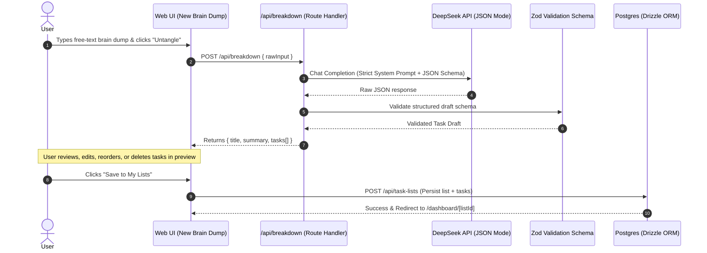

# Untangle — Architecture & Technical Reference

This document outlines the architecture, data flow, conventions, and design decisions for **Untangle** — an AI-powered task breakdown application.

---

## 1. System Architecture & Layers

Untangle follows **Clean Architecture** principles to separate UI components, application use cases/services, and database persistence layers.

```
┌────────────────────────────────────────────────────────┐
│                   Presentation Layer                   │
│   Next.js 16 App Router (RSC & Interactive Client)     │
│   • app/page.tsx (Landing + Interactive Demo)          │
│   • app/(auth)/* (Login & Register)                    │
│   • app/(dashboard)/* (Lists, New Brain Dump, Tasks)   │
└───────────────────────────┬────────────────────────────┘
                            │
┌───────────────────────────▼────────────────────────────┐
│                    API & Proxy Layer                   │
│   • proxy.ts (Next.js 16 Route Guard)                  │
│   • app/api/auth/* (Better Auth Handlers)              │
│   • app/api/breakdown/route.ts (AI Task Generation)    │
│   • app/api/task-lists & tasks routes (CRUD API)       │
└───────────────────────────┬────────────────────────────┘
                            │
┌───────────────────────────▼────────────────────────────┐
│                  Application & Domain                  │
│   • lib/ai/breakdown.ts (Prompting + JSON Schema)      │
│   • lib/services/task-service.ts (Task Logic)          │
│   • lib/services/breakdown-service.ts                  │
│   • lib/ai/schemas.ts (Zod Validation)                 │
└───────────────────────────┬────────────────────────────┘
                            │
┌───────────────────────────▼────────────────────────────┐
│             Data Access & Persistence (ORM)            │
│   • lib/repositories/task-repository.ts                │
│   • lib/repositories/task-list-repository.ts           │
│   • lib/db/schema.ts (Drizzle Schema)                  │
│   • lib/db/index.ts (Postgres / Neon Client)           │
└────────────────────────────────────────────────────────┘
```

---

## 2. Data Flow: Brain Dump to Actionable Tasks



---

## 3. Database Schema (Drizzle ORM)

### Tables
1. **`user`**: `id`, `name`, `email`, `emailVerified`, `image`, `createdAt`, `updatedAt`
2. **`session`**: `id`, `userId`, `token`, `expiresAt`, `ipAddress`, `userAgent`, `createdAt`, `updatedAt`
3. **`account`**: `id`, `userId`, `accountId`, `providerId`, `accessToken`, `refreshToken`, `password`, `createdAt`, `updatedAt`
4. **`verification`**: `id`, `identifier`, `value`, `expiresAt`, `createdAt`, `updatedAt`
5. **`task_lists`**:
   - `id`: UUID / Text (Primary Key)
   - `userId`: Text (Foreign Key -> user.id)
   - `title`: VarChar(255)
   - `rawInput`: Text (Original brain dump text)
   - `createdAt`: Timestamp
   - `updatedAt`: Timestamp
6. **`tasks`**:
   - `id`: UUID / Text (Primary Key)
   - `taskListId`: Text (Foreign Key -> task_lists.id on cascade delete)
   - `userId`: Text (Foreign Key -> user.id)
   - `title`: VarChar(255)
   - `description`: Text (Nullable)
   - `priority`: Enum (`low`, `medium`, `high`)
   - `dueDate`: Timestamp (Nullable)
   - `isDone`: Boolean (Default: false)
   - `sortOrder`: Integer (Default: 0)
   - `createdAt`: Timestamp
   - `updatedAt`: Timestamp

---

## 4. Design Guidelines & Styling Tokens

- **Warm Palette (Tailwind 4 CSS Variables)**:
  - Background Light: `#faf8f5` (warm cream)
  - Background Dark: `#141210` (warm charcoal)
  - Accent Primary: `#d97706` (warm amber) / `#c2410c` (terracotta)
  - Border Light: `#e7e2d9`
  - Border Dark: `#262320`
- **Typography**: Geist Sans with clean typographic hierarchy.
- **Micro-Interactions**: Gentle fade-in transitions, skeleton loaders during AI processing, and strike-through animations on task completion.
